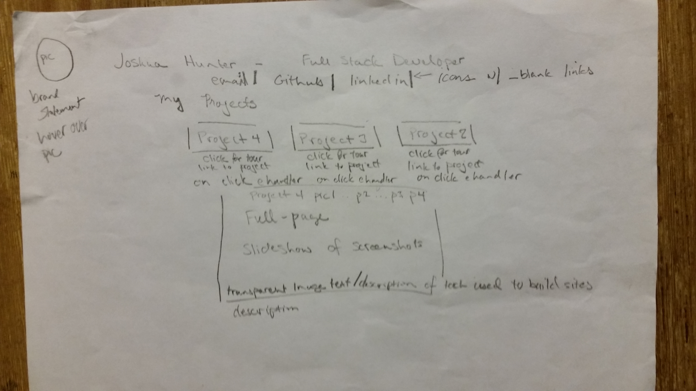
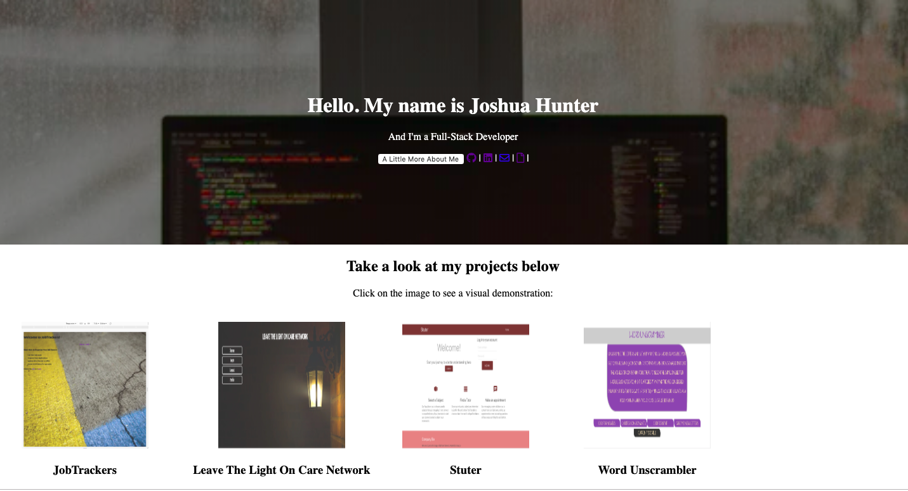

# joshhunter-portfolio
GA Portfolio

# Foundation
My Portfolio is built with Javascript, HTML, and CSS. I chose this implementation over more complex tools because I wanted folks interested in my work to simply be able to see them, link to github, linked in, and to the projects. I initially started building a React portfolio but elected to reroute because a React project lives in a virtual DOM and therefore gets downgraded in SEO ratings. I want people to find my site -- easily and quickly. Streamlining it and building it this way helps meet the objetives of a clean layout, accurate linking, and informative. And that is what I want it to be. You will note that several of the posted projects are REACT based and so if you are looking for a rendering that features React, you've come to the right place. Welcome in!

## Page Layout

Once I decided to let go of the React version, I did some research and came up with this layout for a clean representation of my projects.

## Development Log
I tested some ideas I gathered from my research on Codepen as a place to start seeing it come to life. It was definitely a work in progress and very rough, but my ideas generated successfully in Codepen so my confidence was high that I could generate a portfolio from the ground-up.
Day One was simply coordinating Github and making sure my directories and files committed to github properly.

Day Two was gathering stills of my project start page and generating the header. My name, description, and activating a modal button that presents my brand statement nicely (although the images needed centering desperately)

Day3 - I centered the images, edited a few of the lines, and began planning a slideshow rendering of the project tours..
And that is all that is left to complete!

